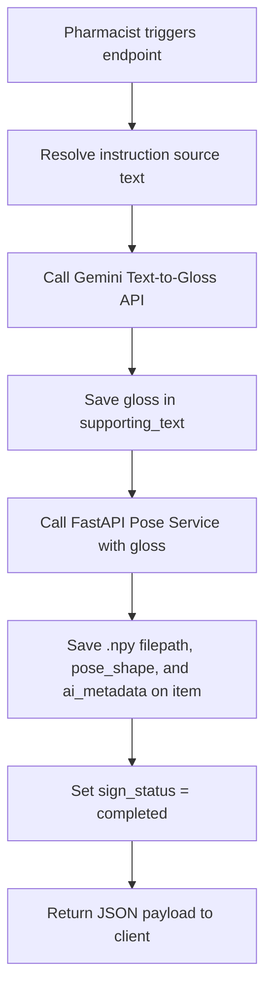

# PharmaSign Backend Current Status Summary

## 1. Executive Summary
This document provides a comprehensive senior-level technical audit and status report for the **PharmaSign Backend Project** (Django 5.1 & Django REST Framework), located at `c:\Users\alaan\Desktop\PharmaSign_BackEnd`.

### Core Capabilities Supported:
- **Approval-Aware Multi-Role Authentication**: JWT-based authentication using dynamic, role-based approval blocks that prevent pending or rejected non-staff users (patients and pharmacists) from logging in or refreshing tokens.
- **Static & Dynamic Patient QR Systems**: Secure static QR login flows using hashed token verification or legacy QR value lookups. Short-lived, one-time Patient-Pharmacist session QR generation and validation.
- **Pharmacist-Led Clinical Workflow**: Structured prescription lifecycle from draft, submission, pharmacist confirmation, patient delivery, archiving, or cancellation. Includes audio uploading and automated/manual transcription pipelines.
- **Pricing & Billing Engine**: Automated line-total calculations (`unit_price * quantity`) and prescription-level grand total aggregation (`total_price`) verified and calculated entirely on the server.
- **AI-Driven Sign-Language Generation Pipeline**: Chained Text-to-Gloss translation using Google's Gemini Flash model and subsequent Gloss-to-Pose 3D coordinate generation via an external FastAPI service, saving keyframe shapes and `.npy` coordinates.
- **Scoped Admin Dashboard & Auditing**: Strict organization-scoped views for dashboard metrics, patient cards, pharmacists, pharmacies, approval requests, prescription histories, and safe activity logs.

### Feature Implementation Status Matrix:
| Feature / Area | Status | Implementation Details |
| :--- | :--- | :--- |
| **User Authentication & JWT** | **Fully Implemented** | Approved-active logic for Patient and Pharmacist. Pending/rejected users are blocked. Tokens can be blacklisted. |
| **Forgot Password / OTP Recovery** | **Fully Implemented** | OTP request and hash-validation pathways specifically for patient/pharmacist password reset using `PhoneOTP`. |
| **Patient Profile & QR Login** | **Fully Implemented** | Secure static QR login via token hashes. Legacy QR+PIN compatibility layer preserved. First-password setup pathway. |
| **Patient-Pharmacist Sessions** | **Fully Implemented** | Short-lived (300s), one-time-use dynamic session QRs to grant pharmacists secure record access. |
| **Prescription Lifecycle & Pricing** | **Fully Implemented** | Multi-state transitions, unit-price validation, auto line/grand-total pricing recalculation on item write/delete. |
| **Audio Transcription Engine** | **Fully Implemented** | Dual-backend framework supporting standard or Gemini audio-to-text with error-sanitized exception handling. |
| **AI Translation (Text-to-Gloss)** | **Fully Implemented** | Gemini sign gloss generation using configured prompt templates, prioritizing edited transcripts, raw transcripts, or manual texts. |
| **AI Generation (Gloss-to-Pose)** | **Fully Implemented** | FastAPI integration generating 3D coordinate matrixes (saved to `.npy` file paths) with JSON and binary serializers. |
| **Sign Quality Reporting** | **Fully Implemented** | Patient reporting endpoint with duplicate open-report constraints. Scoped admin viewing and PATCH-based status updates. |
| **Admin Scoped Activity Log** | **Fully Implemented** | In-memory timeline constructor from scoped prescriptions and quality reports. Filters out sensitive fields. |
| **Admin Settings & Org Profile** | **Fully Implemented** | Lazy initialization of Organization and staff profile profiles. Scoped GET and partial PATCH. |
| **Avatar / 3D Video Renderer** | **Not Implemented** | The pipeline stops at Gloss-to-Pose (.npy files). Video rendering (`video_url`) returns `None`. |

---

## 2. Project Structure
The PharmaSign backend is structured as a modular Django application with localized domain layers.

### Directory Mapping & Local Applications:
- **Main Django Project Directory**: `pharmasign/`
  - `settings.py`: Contains JWT configurations, upload constraints, Gemini configurations, and external AI service properties.
  - `urls.py`: Orchestrates root routing including the default Django admin site.
  - `api_urls.py`: Maps main API route sub-paths (`accounts`, `patients`, `pharmacies`, `prescriptions`, `transcriptions`, `ai`).
- **Installed Local Apps**:
  - `accounts/` (Path: `accounts/`): Handles user profiles, JWT creation, custom role checks, registration workflows, and `PhoneOTP` verification.
  - `patients/` (Path: `patients/`): Manages patient profile attributes, static login QR hashes, dynamic pharmacist session QRs, and patient settings.
  - `pharmacies/` (Path: `pharmacies/`): Manages pharmacy profiles (contracted vs public), pharmacists, and pharmacist registration requests.
  - `prescriptions/` (Path: `prescriptions/`): Coordinates prescription headers, pricing line items, sign quality reports, access logs, and clinical metadata.
  - `organizations/` (Path: `organizations/`): Manages organization structures and staff authorization profiles.
  - `transcriptions/` (Path: `transcriptions/`): Performs audio file verification and processes Gemini-based transcription queries.
  - `ai_integration/` (Path: `ai_integration/`): Manages direct socket/HTTP requests to the external Gloss-to-Pose coordinate compiler service.
  - `common/` (Path: `common/`): Provides cross-cutting shared resources, model mixins (`TimeStampedModel`), validation filters, and standardized API error handlers.

### Key Shared & Infrastructure Files:
- `common/choices.py`: Shared enums for status types, genders, blood groups, and hearing conditions.
- `common/permissions.py`: Custom security check classes including `IsAdminRole`, `CanManagePatients`, `IsApprovedPharmacistRole`.
- `common/uploads.py`: File size and MIME type filters protecting audio, image, and video uploads.
- `transcriptions/validators.py`: Custom file validator enforcing audio length and size constraints.

---

## 3. Authentication and Roles
PharmaSign uses a robust custom authentication system integrated with **Django REST Framework SimpleJWT**.

### User Model and Role Choices:
- **Model**: `User` in [accounts/models.py](file:///c:/Users/alaan/Desktop/PharmaSign_BackEnd/accounts/models.py) (inherits from `AbstractBaseUser` and `PermissionsMixin`).
- **Role Choices** (`RoleChoices` in [common/choices.py](file:///c:/Users/alaan/Desktop/PharmaSign_BackEnd/common/choices.py)):
  - `"patient"`: Patient account role.
  - `"pharmacist"`: Registered pharmacist role.
  - `"admin"`: Administrative staff.
- **Approval Status Choices** (`ApprovalStatusChoices` in [common/choices.py](file:///c:/Users/alaan/Desktop/PharmaSign_BackEnd/common/choices.py)):
  - `"pending"`: Account is created but waiting for admin approval.
  - `"approved"`: Account is verified and approved.
  - `"rejected"`: Account has been rejected by an administrator.

### Supported Roles & Staff Behavior:
- **Superuser/Staff Behavior**: Superusers (`is_superuser=True`) or users with role `"admin"` bypass organization scoping constraints and can manage accounts globally.
- **Pending/Rejected Blocking**: Handled inside `accounts/views.py` via `_approval_block_response` and inside simple JWT authentication middlewares. If a user's `approval_status` is not `"approved"` (or if a pharmacist's `is_approved` is `False`), their requests receive a `403 Forbidden` response (`approval_pending` or `approval_rejected`).

### Key Auth Endpoints:
- **Login**: `POST /api/auth/login/` (Public) -> Authenticates using email/phone and password, returning tokens and profile details.
- **Admin Login**: `POST /api/admin/auth/login/` (Admin Role Enforced) -> Logs in admins/superusers and checks staff credentials.
- **Token Refresh**: `POST /api/auth/refresh/` (Public) -> Custom refresh view (`ApprovalAwareTokenRefreshView`) that re-verifies approval status before issuing new access keys.
- **Logout**: `POST /api/auth/logout/` / `POST /api/admin/auth/logout/` (Authenticated) -> Blacklists the supplied refresh token.
- **Current User Context**: `GET /api/auth/me/` / `GET /api/admin/auth/me/` -> Returns role-specific serialized information.

### Permission Classes ([common/permissions.py](file:///c:/Users/alaan/Desktop/PharmaSign_BackEnd/common/permissions.py)):
- `IsAdminRole`: Enforces user role is `"admin"` or user is a superuser.
- `IsPatientRole`: Enforces user role is `"patient"`.
- `IsPharmacistRole`: Enforces user role is `"pharmacist"`.
- `IsApprovedPharmacistRole`: Enforces role is `"pharmacist"` AND `is_approved` profile boolean is `True`.
- `CanManagePatients` / `CanManagePharmacists`: Scopes staff profiles based on permission booleans (`can_manage_patients`, `can_manage_pharmacists`).

---

## 4. Patient Account and QR Login Flow
PharmaSign offers dual pathways for patient onboarding and rapid sign-in.

### A. Static QR Login Flow
- **Endpoint**: `POST /api/auth/patient/qr-login/`
- **Request Parameters**:
  ```json
  {
    "qr_code_value": "uuid-value-extracted-from-physical-card"
  }
  ```
- **Login Verification**:
  1. The API queries `PatientProfile` where `qr_code_value` matches the input and `qr_is_active` is `True`.
  2. Resolves the associated patient `User` record.
  3. No OTP code or custom PIN is required when using a valid, active QR code value.
- **Response Shape**: Returns standardSimpleJWT payload plus a flag:
  ```json
  {
    "user": { ... },
    "profile": { ... },
    "access": "jwt-access-token",
    "refresh": "jwt-refresh-token",
    "must_set_password": true
  }
  ```
  *(Note: `must_set_password` is `True` if the user account has no usable password set yet, indicating they must set an initial password).*

### B. Compatibility Pathway (`qr_token` support)
- The endpoint supports backward-compatibility where a `qr_token` field is accepted instead of `qr_code_value`.
- **Precedence**: The serializer (`PatientQRLoginSerializer` in [accounts/serializers.py](file:///c:/Users/alaan/Desktop/PharmaSign_BackEnd/accounts/serializers.py)) checks for `qr_token` first. If present, it resolves the token via `PatientLoginQR` token-hash validation. If missing, it falls back to checking `qr_code_value`.
- This dual compatibility ensures newer tokenized QR logins and legacy static QR login mechanisms work seamlessly.

### C. First Password Setup
- **Endpoint**: `POST /api/auth/patient/set-initial-password/`
- **Request Body**:
  ```json
  {
    "new_password": "SecurePassword123",
    "confirm_password": "SecurePassword123"
  }
  ```
- **Auth Requirements**: Patient must be authenticated (using the JWT returned from QR login).
- **Error Codes**:
  - `password_already_set` (`400 Bad Request` if `user.has_usable_password()` is `True`).
  - `passwords_do_not_match` (`400 Bad Request` if passwords do not match).
  - `password_too_weak` (`400 Bad Request` if Django's built-in strength validators fail).
- **Success Response**: `{"detail": "Password set successfully."}`. Additionally, it marks `is_verified = True` on the user model.

### D. Phone and Password Sign-In
- Once the initial password is configured, the patient can sign in via the standard authentication API:
  - `POST /api/auth/login/` sending `phone_number` (or `phone` alias) and `password`.

### E. Static QR Admin Generation
Inside [patients/views.py](file:///c:/Users/alaan/Desktop/PharmaSign_BackEnd/patients/views.py) (via `AdminPatientViewSet`), administrative staff can trigger static QR fields:
- `POST /api/admin/patients/<id>/generate-qr/`: Generates or regenerates (`regenerate=True`) a stable `qr_code_value` string on `PatientProfile`.
- `POST /api/admin/qr-codes/<id>/regenerate/`: Invalidates the previous static code and generates a new one.
- `POST /api/admin/qr-codes/<id>/disable/`: Deactivates static QR login by setting `qr_is_active=False`.
- `POST /api/admin/qr-codes/<id>/reactivate/`: Restores static QR login by setting `qr_is_active=True`.

> [!IMPORTANT]
> **Patient Login QR vs Patient-Pharmacist Session QR**:
> 1. **Patient Login QR**: Stable, static uuid string saved directly on `PatientProfile.qr_code_value` (or persistent hashed values in `PatientLoginQR`). Utilized to log the patient into their mobile device.
> 2. **Patient-Pharmacist Session QR**: Highly temporary, short-lived (expiry in 300s), single-use OTP token represented in `PatientSessionQR` that a patient generates on their phone and a pharmacist scans to gain temporary read/write access.

---

## 5. Forgot Password Flow
The forgot password engine uses SMS/WhatsApp validation pathways for patients and pharmacists.

### API Mechanics:
1. **Request OTP Code**:
   - **Endpoint**: `POST /api/auth/password-reset/request-otp/`
   - **Request Body**:
     ```json
     {
       "role": "patient",
       "phone_number": "+9639XXXXXXXX"
     }
     ```
   - **Supported Roles**: `"patient"`, `"pharmacist"`. Admin roles are excluded from this flow.
   - **Behavior**: Generates a 6-digit random code, hashes it using PBKDF2 (`make_password`), stores it in `PhoneOTP` linked to the user, and attempts delivery.

2. **Confirm Password Reset**:
   - **Endpoint**: `POST /api/auth/password-reset/confirm/`
   - **Request Body**:
     ```json
     {
       "role": "patient",
       "phone_number": "+9639XXXXXXXX",
       "otp": "123456",
       "new_password": "NewSecurePassword123",
       "confirm_password": "NewSecurePassword123"
     }
     ```

### OTP Storage & Safety Rules:
- **Hashing**: OTPs are hashed using PBKDF2 (`make_password`) and saved in `PhoneOTP.code_hash`. Raw values are never saved.
- **Expiry duration**: Hardcoded to **300 seconds** (5 minutes) in `accounts.services.OTP_EXPIRY_SECONDS`.
- **Lockout behavior**: A single OTP allows a maximum of **5 attempts** (`PhoneOTP.max_attempts`). Once attempts reach this threshold, the OTP status is locked by setting `used_at = timezone.now()`.
- **Token Blacklisting**: After a successful password reset, the backend automatically blacklists all existing SimpleJWT active tokens (`OutstandingToken`) associated with the user, forcing a clean logout across all active sessions.

### API Error Codes:
- `invalid_otp`: OTP value is incorrect or does not match the active challenge.
- `otp_expired`: The 300-second window has closed.
- `otp_locked`: Attempts have exceeded the limit of 5.
- `passwords_do_not_match`: Password and confirmation fields do not match.
- `password_too_weak`: The chosen password fails core Django strength validation rules.
- `missing_required_field`: Phone number or role field is omitted.

---

## 6. Admin Backend
Administrative features are scoped according to organization boundaries in [prescriptions/views.py](file:///c:/Users/alaan/Desktop/PharmaSign_BackEnd/prescriptions/views.py) and [patients/views.py](file:///c:/Users/alaan/Desktop/PharmaSign_BackEnd/patients/views.py).

### A. Admin Authentication
- **Login**: `POST /api/admin/auth/login/` (Authenticates administrative staff and returns JWT keys).
- **Me Profile**: `GET /api/admin/auth/me/` (Returns admin user attributes and staff permissions).
- **Logout**: `POST /api/admin/auth/logout/` (Blacklists administrative tokens).
- **Change Password**: `POST /api/admin/auth/change-password/`
  - Body: `{"current_password": "...", "new_password": "...", "confirm_password": "..."}`
  - Error Codes: `current_password_incorrect`, `passwords_do_not_match`, `password_too_weak`, `password_same_as_old`.

### B. Organization Settings
- **Endpoints**: `GET /api/admin/organization/me/` & `PATCH /api/admin/organization/me/`
- **Auto-Initialization**: If an authenticated admin has no active `OrganizationStaffProfile`, the backend automatically initializes a default `Organization` (e.g., "Organization for [AdminName]") and associates it with the user via a new staff profile behind a transaction.
- **Scoping**:
  - Administrative staff can view/edit their own organization profile.
  - Normal patients and pharmacists are blocked with `403 Forbidden` (`IsAdminRole` enforced).

### C. Dashboard Metrics
- **Endpoint**: `GET /api/admin/dashboard/stats/`
- **Payload Data**:
  - Core Counters: `patients_count`, `pharmacists_count`, `pharmacies_count`, `prescriptions_count`, `active_qr_count`, `pending_approvals_count`.
  - Quality Follow-up Counts: `sign_quality_follow_up_count` (open or reviewed reports).
  - Demographic Charts: `gender_distribution` (gender split), `hearing_severity_distribution` (severity levels).
  - Specific Distributions:
    - `hearing_condition_type_distribution`: Resolves hard-of-hearing, deaf-from-birth, and accident splits.
    - `patients_by_city`: Organizes aggregate user statistics grouped by `city` and `region`.
  - Recent Entries: `recent_patients` and `recent_approval_requests` (limited to 5).
- **Organization Scoping**: If the admin is not a superuser, all lists and metrics are strictly filtered to show records matching the admin's organization.

### D. Patient Administrative Actions
- **CRUD Operations**: Handled by `AdminPatientViewSet` under `/api/admin/patients/`.
- **Fields**: Supports structured filtering by `city`, `region`, and `hearing_condition_type`.
- **Soft Delete**: Deleting a patient does not erase records; it deactivates `User.is_active` and disables their static login QR (`qr_is_active=False`).
- **QR Generation**: Supports generating, viewing, and revoking login QR tokens.

### E. Pharmacist Administrative Actions
- **CRUD Operations**: Handled by `AdminPharmacistViewSet` under `/api/admin/pharmacists/`.
- **Approval Engine**: Approving a pharmacist updates `User.approval_status` to `"approved"` and synchronized `PharmacistProfile.is_approved` to `True`. Rejecting sets status to `"rejected"` and blacklists their active JWTs.
- **Pharmacy Linkage**: Admin must assign pharmacists to a pharmacy (`pharmacy_id`).

### F. Pharmacy Administrative Actions
- **CRUD Operations**: Handled by `AdminPharmacyViewSet` under `/api/admin/pharmacies/`.
- **Organization Auto-Assignment**: When staff administrators register new pharmacies, their organization ID is automatically inherited from the staff admin's profile.
- **Contract Verification**: Setting `is_contracted_with_organization = True` requires an organization. If missing, it raises an `admin_organization_required` validation error.
- **Organization Mismatch**: Attempting to link a pharmacy outside the admin's organization raises an `organization_scope_mismatch` error.
- **Deletion Safety**: Deletion is blocked if the pharmacy is linked to active pharmacists, prescriptions, or patient sessions, raising `pharmacy_delete_blocked`.

### G. Registration & Approval Requests
- **Endpoints**: `GET /api/admin/approval-requests/` & `GET /api/admin/approval-requests/<id>/`
- **Actions**: Approve (`POST .../approve/`) or Reject (`POST .../reject/` supplying an optional `reason` payload).
- Pharmacist approvals automatically synchronize status flags between users and profiles.

### H. Sign Quality Reports
- **Endpoints**: `GET /api/admin/sign-quality-reports/` & `GET /api/admin/sign-quality-reports/<id>/`
- **Detail Payloads**: Exposes reported items, patient profiles, doctors, pharmacies, and pharmacists.
- **PATCH Action**: Admins can append text to `admin_notes` and advance the report status (`open` -> `reviewed` -> `resolved`/`dismissed`).

### I. Safe Admin Activity Log
- **Endpoint**: `GET /api/admin/activity-log/`
- **Safe Exposure**: Synthesizes and returns log rows (prescriptions and sign reports) in memory, omitting sensitive medication details, chemical descriptions, or user credentials.
- **Filtering & Scoping**: Supports `date_from`, `date_to`, `action`, and `target_type` parameters, scoped strictly to the admin's organization.

---

## 7. Patient Clinical/Profile Data
Structured patient information is stored across `PatientProfile` and `PatientMedicalInfo` models.

### Profile Properties (`PatientProfile` in [patients/models.py](file:///c:/Users/alaan/Desktop/PharmaSign_BackEnd/patients/models.py)):
- `user`: One-to-one relationship with the custom User model.
- `organization`: Reference to the patient's associated organization.
- `full_name`: Standard full name string.
- `birth_date` & `gender`: Birth date and gender enums (`M` / `F`).
- `address`, `city`, `region`: String fields mapping physical locations.
- `hearing_disability_level`: Enum mapping severity levels:
  - `"mild"`: Mild hearing loss.
  - `"moderate"`: Moderate hearing loss.
  - `"severe"`: Severe hearing loss.
  - `"profound"`: Profound hearing loss.
- `hearing_condition_type`: Enum mapping primary communication types:
  - `"hard_of_hearing"`: Hard of hearing.
  - `"deaf_from_birth"`: Deaf from birth.
  - `"deaf_due_to_accident"`: Deaf due to accident.
- `is_self_registered`: Flag indicating if the patient registered online or was enrolled by staff.
- `qr_code_value` & `qr_is_active`: Static login credentials and activation flag.
- `record_access_pin_hash`: PBKDF2 hashed PIN used for card validation.

### Medical Sub-Profile (`PatientMedicalInfo` in [patients/models.py](file:///c:/Users/alaan/Desktop/PharmaSign_BackEnd/patients/models.py)):
- `patient`: One-to-one relation to patient profile.
- `blood_type`: Enums (`A+`, `A-`, `B+`, `B-`, `O+`, `O-`, `AB+`, `AB-`).
- `chronic_conditions` / `allergies`: Plain text fields.
- `is_pregnant` / `is_breastfeeding`: Boolean clinical markers.
- `notes`: General medical notes, occasionally parsed by serializers to populate legacy `"regular_medications"` fields.

---

## 8. Pharmacy and Organization Model Logic
Core model architectures control the scoping of medical and corporate data.

### Organization Architecture (`Organization` in [organizations/models.py](file:///c:/Users/alaan/Desktop/PharmaSign_BackEnd/organizations/models.py)):
- Fields: `name`, `description`, `phone`, `address`, `city`, `region`.
- **OrganizationStaffProfile**:
  - Links administrative `User` records with an `Organization`.
  - Stores job titles and administrative permission flags: `can_manage_patients`, `can_manage_pharmacists`.

### Pharmacy Architecture (`Pharmacy` in [pharmacies/models.py](file:///c:/Users/alaan/Desktop/PharmaSign_BackEnd/pharmacies/models.py)):
- Fields: `name`, `address`, `city`, `region`, `license_number`, `latitude`, `longitude`, `phone_number`.
- **Contract Mechanics**:
  - `is_contracted_with_organization` (Boolean).
  - `organization` (ForeignKey).
  - Constraint: Setting the pharmacy as contracted requires linking an organization. If missing, it raises an `admin_organization_required` validation error.

### Organization Scoping Implementation:
- **Write Actions**: Administrators can only create or update pharmacies within their own organization. Attempting to assign outside scopes raises `organization_scope_mismatch`.
- **Read Operations**: Querysets in `AdminPharmacyViewSet` are filtered to match the administrator's organization, preventing staff from viewing or editing pharmacies linked to other organizations. Superusers are exempt from these scoping rules.

---

## 9. Prescription Workflow
PharmaSign enforces a strict multi-state transactional lifecycle for prescriptions.

```mermaid
stateDiagram-chart
    [*] --> draft : Pharmacist Init
    draft --> submitted : Submit (Requires 1+ Items)
    submitted --> confirmed : Pharmacist Confirm (Session Valid)
    confirmed --> delivered : Deliver to Patient
    delivered --> [*]
    draft --> cancelled : Cancel
    submitted --> cancelled : Cancel
    confirmed --> cancelled : Cancel
    delivered --> archived : Archive
    archived --> [*]
```

### Models & Pricing Sub-System:
- **Prescription Model** ([prescriptions/models.py](file:///c:/Users/alaan/Desktop/PharmaSign_BackEnd/prescriptions/models.py)):
  - Fields: `patient`, `pharmacist`, `pharmacy`, `session`, `doctor_name`, `doctor_specialty`, `diagnosis`, `status`, `notes`.
  - Aggregate Pricing: `total_price` (Decimal), `currency` (Defaults to `"SYP"`).
  - `reused_from`: Points to self to trace prescription renewals.
- **PrescriptionItem Model**:
  - Core Properties: `medicine_name`, `dosage`, `frequency`, `duration`, `instructions_text`, `medicine_image`.
  - Item Pricing: `unit_price` (Decimal), `quantity` (Decimal, defaults to `1.00`), `line_total` (Decimal, `unit_price * quantity`).
  - Pricing Legacy Alias: `price` is synchronized with `unit_price` to support legacy mobile contracts.

### Automated Pricing Recalculation:
- To prevent price manipulation, pricing totals are calculated entirely on the server.
- Inside `PrescriptionItem.save()`, the item's `line_total` is set to `unit_price * quantity`.
- After saving or deleting an item, `prescription.recalculate_total_price()` is triggered. This aggregates all active line totals (`Sum("line_total")`) and updates `prescription.total_price`.

### Clinical Access Log:
- **PrescriptionAccessLog** ([prescriptions/models.py](file:///c:/Users/alaan/Desktop/PharmaSign_BackEnd/prescriptions/models.py)):
  - Automatically records clinical audit events when prescriptions are viewed (`VIEW`), transcribed (`TRANSCRIBE`), updated (`ITEM_UPDATE`), or confirmed (`CONFIRM`).
  - Properties: `prescription`, `accessed_by` (User), `access_type`, `timestamp`.
  - Sensitivity: Exposes access metadata without exposing sensitive medicine profiles or diagnostic notes.

---

## 10. Transcription Flow
PharmaSign processes audio medication instructions using external AI models.

### Step-by-Step Workflow:
1. **Audio File Upload**:
   - The pharmacist uploads an audio file via:
     `POST /api/pharmacist/prescriptions/<id>/items/<item_id>/transcribe-audio/`
   - Files are validated against size and length limits before being saved to `instructions_audio`.
   - The backend sets `transcription_status = "processing"` and schedules the transcription task.
2. **Transcription Backend Selection**:
   - The system checks `settings.GEMINI_API_KEY`. If configured, it routes the audio to the Google Gemini model.
   - If the API key is missing, it falls back to a mock/placeholder backend in development, raising `transcription_provider_not_configured` in production.
3. **Gemini Execution**:
   - The audio file is read into binary chunks and sent to the Gemini API (`GEMINI_MODEL`), using the system prompt:
     `STRICT_PHARMACY_TRANSCRIPTION_PROMPT = "Transcribe the Arabic pharmacy instruction audio exactly. Return only the spoken text. Do not summarize. Do not translate. Do not add explanations. Preserve medication names and numbers as spoken."`
4. **Data Updates**:
   - On success, the raw transcription is saved to `instructions_transcript_raw`, and the status updates to `"completed"`.
   - If transcription fails, the error message is caught, sanitized, saved to `transcription_error_message`, and the status is set to `"failed"`.
5. **Transcript Approval & Editing**:
   - The pharmacist can edit and approve the text via:
     `POST /api/pharmacist/prescriptions/<id>/items/<item_id>/approve-transcript/`
   - Body: `{"approved_instruction_text": "Modified instructions..."}`
   - Updates `instructions_transcript_edited` and marks the status as approved.

---

## 11. Gemini Text-to-Gloss Flow
Once approved transcriptions are available, they are compiled into sign language glosses.

### Core Variables & Model Settings:
- **System Prompt Template**: `SIGN_GLOSS_PROMPT_TEMPLATE` in [prescriptions/services.py](file:///c:/Users/alaan/Desktop/PharmaSign_BackEnd/prescriptions/services.py).
- **Core Action Method**: `generate_sign_gloss(approved_text)`.
- **Model Setting**: Evaluated using `settings.GEMINI_SIGN_MODEL`.
- **API Key Reference**: Uses the global environment variable `settings.GEMINI_API_KEY`.

### Source Selection Priority:
When generating sign glosses, the system selects input text according to this priority order:
1. `instructions_transcript_edited`: The edited and approved transcription text.
2. `instructions_transcript_raw`: The raw, unedited transcription text.
3. `instructions_text`: Pre-typed clinical instruction text.

### Output Properties:
- `gloss_text`: The signed Arabic sign-language gloss output generated by the Gemini model.
- `supporting_text`: Stores the generated gloss text on the model for compatibility.

### State Pipeline Updates:
- Successful generation sets `PrescriptionItem.sign_status` to `"completed"`, saves the gloss to `supporting_text`, and returns the translated text.
- Generation errors catch the exception, log details in debug environments, and set the item status to `"failed"`.

> [!WARNING]
> **Prompt Encoding / Arabic Diacritic Issues**:
> Inside [prescriptions/services.py:L24](file:///c:/Users/alaan/Desktop/PharmaSign_BackEnd/prescriptions/services.py#L24), the prompt contains literal `??????` character representations instead of valid Arabic diacritics (e.g., `Prefer direct phrases such as: ?????? ?????? ...`).
> This indicates a file encoding issue where Arabic characters were saved as question marks, which can confuse the LLM and cause poor sign gloss translations.

---

## 12. AI Integration / Gloss-to-Pose
After generating the text gloss, the backend coordinates with an external service to compile 3D poses.

### System Variables:
- **AI Service URL**: `settings.AI_SERVICE_URL` (Points to the external FastAPI 3D pose compiler service).
- **Security Access Key**: `settings.AI_SERVICE_API_KEY` (Passed in headers as `X-API-Key`).
- **Timeout Limit**: `settings.AI_SERVICE_TIMEOUT` (Defaults to 60 seconds).

### API View Integration:
- **Health Check Endpoint**: `GET /api/ai/health/` -> Verifies connection to the external FastAPI health endpoint.
- **Generate Pose Endpoint**: `POST /api/ai/generate-pose/`
  - Request Body:
    ```json
    {
      "gloss": "دواء حبة الصبح قبل الاكل",
      "return_format": "npy" // Supports "npy" (binary) or "json" (coordinate matrix)
    }
    ```
  - Response Payloads:
    ```json
    {
      "success": true,
      "gloss": "دواء حبة الصبح قبل الاكل",
      "pose_shape": [124, 137, 3],
      "file_path": "/app/poses/generated_pose_xyz.npy",
      "metadata": {
        "generator": "FastAPI-Pose-Service",
        "fps": 30
      }
    }
    ```

### Command Tool Verification:
- **Management Command**: `python manage.py test_ai_pose --gloss "دواء الصبح" --format npy`
- Safely tests health checks and pose generation, printing results to the console.

---

## 13. Full Generate-Sign Pipeline
The sign generation endpoint coordinates the entire Text-to-Gloss and Gloss-to-Pose pipeline.

- **Endpoint**: `POST /api/pharmacist/prescriptions/<prescription_id>/items/<item_id>/generate-sign/`
- **Execution Pipeline**:



### Detailed Output Structure:
On success, the endpoint returns a unified sign and pose payload:
```json
{
  "item_id": 45,
  "sign_status": "completed",
  "gloss_text": "دواء حبة الصبح قبل الاكل",
  "supporting_text": "دواء حبة الصبح قبل الاكل",
  "pose": {
    "success": true,
    "gloss": "دواء حبة الصبح قبل الاكل",
    "pose_shape": [150, 137, 3],
    "file_path": "/var/ai/poses/item_45.npy",
    "metadata": { ... }
  },
  "video_url": null,
  "output_type": "gloss_and_pose",
  "video_generation_supported": false,
  "detail": "Gloss and pose generated successfully"
}
```

### Error Mitigation Pathways:
- **Gemini Failure**: If the Text-to-Gloss step fails, the pipeline aborts immediately, setting `sign_status = "failed"`.
- **FastAPI Pose Failure**: If the FastAPI pose step fails after the Gemini translation succeeds, the generated gloss is preserved in `supporting_text`, but `sign_status` is updated to `"failed"` due to the coordinate compilation error.
- **Null Video Property**: Because the backend does not integrate a 3D avatar video renderer, the `video_url` property always returns `null`. Poses are delivered to the frontend as coordinate matrices (`.npy` file paths).

---

## 14. Patient-Pharmacist Session QR Flow
Dynamic session QRs allow patients to securely grant pharmacists access to their medical records.

### Model Attributes (`PatientSessionQR` in [patients/models.py](file:///c:/Users/alaan/Desktop/PharmaSign_BackEnd/patients/models.py)):
- `patient`: Reference to the patient profile.
- `token_hash`: SHA-256 hashed representation of the single-use session token.
- `expires_at`: Verification deadline timestamp.
- `used_at`: Timestamp recording when the pharmacist scanned the code.
- `revoked_at`: Timestamp recording when the token was invalidated.

### Integration Mechanics:
1. **Generate Session QR**:
   - The patient requests a dynamic session QR via:
     `POST /api/patients/me/session-qr/`
   - The backend invalidates any previous session QRs (`revoked_at = timezone.now()`).
   - Generates a cryptographically secure token, hashes it, saves it in `token_hash`, and returns the raw token to the patient with a **300-second (5-minute)** expiry window.
2. **Start Session by QR**:
   - The pharmacist scans the QR code and sends the token via:
     `POST /api/pharmacist/sessions/start-by-qr/`
     Body: `{"token": "raw-token-value-from-scanner"}`
   - The backend hashes the input token, validates it against active `PatientSessionQR` records, checks for expiry, and marks it as used (`used_at = timezone.now()`).
   - A new `PatientSession` is created, linking the patient, pharmacist, and pharmacy. This session allows the pharmacist to create and manage prescriptions for the patient.

---

## 15. Sign Quality Report Flow
The quality reporting system allows patients to flag unclear sign language translations.

### Patient Submission:
- **Endpoint**: `POST /api/patients/me/prescriptions/items/<item_id>/report-sign-issue/`
- **Request Body**:
  ```json
  {
    "report_type": "sign_unclear"
  }
  ```
- **Duplicate Prevention**: The backend enforces a unique constraint (`unique_open_sign_quality_report`) on `SignQualityReport`, preventing patients from filing multiple open reports for the same prescription item.
- **Record Compilation**: The backend extracts the instruction text (`instructions_text`, `instructions_transcript_edited`, or `instructions_transcript_raw`) and creates a `SignQualityReport` record in the `"open"` state.

### Administrative Audit interface:
- **Endpoints**: `GET /api/admin/sign-quality-reports/` & `GET /api/admin/sign-quality-reports/<id>/`
- **Filtering**: Supports filtering reports by `status`, `report_type`, `patient_id`, and `prescription_id`.
- **Review Notes**: Administrators can update reports via `PATCH /api/admin/sign-quality-reports/<id>/`, allowing them to add notes to `admin_notes` and update the status (`open` -> `reviewed` -> `resolved` / `dismissed`).
- **Data Protection**: Detailed views expose the associated pharmacist and pharmacy, but restrict access to other medicine records or patient files.

---

## 16. Safe Admin Activity Log
The activity log provides a safe, filtered audit trail for administrators.

- **Endpoint**: `GET /api/admin/activity-log/`
- **Scoping**:
  - Superusers can view logs globally.
  - Staff administrators are limited to viewing prescriptions and quality reports linked to their own organization.
- **Timeline Construction**: The backend queries scoped prescriptions and sign quality reports, compiles their status transitions (submitted, delivered, confirmed, cancelled, archived for prescriptions; and created, reviewed, resolved, dismissed for reports) in memory, and returns them in a chronologically sorted list.

### Returned Payload Structure:
```json
{
  "id": "prescription-12-submitted",
  "actor": {
    "id": 4,
    "full_name": "Dr. Sarah R.",
    "role": "pharmacist"
  },
  "action": "prescription_submitted",
  "action_label": "تم تقديم الوصفة الطبية",
  "target_type": "prescription",
  "target_id": 12,
  "target_label": "Prescription #12",
  "pharmacy_name": "Al-Amal Pharmacy",
  "created_at": "2026-06-02T05:00:00Z",
  "status": "submitted"
}
```

### Data Exclusions:
To protect patient privacy, the activity log excludes sensitive fields such as medicine lists, diagnostic notes, patient phone numbers, national IDs, and raw OTP or session tokens.

---

## 17. Current Database/Migrations Summary
The database schema has evolved through structured migrations across five core applications.

### Accounts Migration Pathway (`accounts/migrations/`):
- `0001_initial`: Defines the custom `User` model, specifying email, phone, role, and staff flags.
- `0002_user_is_staff_alter_user_role`: Adjusts staff flags and adds administrative choices.
- `0003_alter_user_email_alter_user_phone_number`: Aligns unique constraints on user identifiers.
- `0004_phoneotp`: Establishes the `PhoneOTP` model, including purposes, codes, and attempts.
- `0005_user_approval_status_user_approved_at_and_more`: Integrates approval workflow fields (`approval_status`, `approved_at`, `approved_by`, `rejection_reason`).
- `0006_alter_phoneotp_purpose`: Alters the OTP purpose options to include password reset pathways.

### Organizations Migration Pathway (`organizations/migrations/`):
- `0001_initial`: Defines `Organization` and `OrganizationStaffProfile` structures.
- `0002_organization_city_organization_region`: Adds `city` and `region` fields to the organization model.

### Patients Migration Pathway (`patients/migrations/`):
- `0001_initial`: Establishes `PatientProfile`, `PatientEnrollment`, and `PatientMedicalInfo`.
- `0002_patientsession`: Defines the `PatientSession` model.
- `0003_patientsettings`: Adds the `PatientSettings` user preference model.
- `0004_patientloginqr`: Implements the `PatientLoginQR` model for QR token lookups.
- `0005_patientsessionqr_patientsession_expires_at_and_more`: Adds short-lived `PatientSessionQR` and session expiry limits.
- `0006_patientmedicalinfo_blood_type`: Adds a structured `blood_type` enum to medical info.
- `0007_patientprofile_city_region_hearing_condition_type`: Adds `city`, `region`, and `hearing_condition_type` fields directly to the patient profile.

### Pharmacies Migration Pathway (`pharmacies/migrations/`):
- `0001_initial`: Establishes `Pharmacy` and `PharmacistProfile` models.
- `0002_pharmacy_city_pharmacy_region`: Adds `city` and `region` fields to pharmacies.
- `0003_pharmacy_license_number`: Adds a `license_number` field to the pharmacy model.

### Prescriptions Migration Pathway (`prescriptions/migrations/`):
- `0001_initial`: Establishes `Prescription`, `PrescriptionItem`, and `PrescriptionAccessLog`.
- `0002_prescriptionitem_transcription_completed_at_and_more`: Integrates audio and transcription status fields.
- `0003_prescription_diagnosis_prescription_session_and_more`: Links prescriptions to sessions and adds diagnostic fields.
- `0004_signqualityreport`: Establishes the `SignQualityReport` model.
- `0005_prescription_currency_prescription_total_price_and_more`: Adds `total_price` and `currency` to prescriptions, and pricing fields (`unit_price`, `quantity`, `line_total`) to items.
- `0006_signqualityreport_admin_notes`: Adds the `admin_notes` field to quality reports.
- `0007_prescriptionitem_ai_metadata_and_more`: Adds 3D pose tracking fields (`pose_file_path`, `pose_shape`, `ai_metadata`, `pose_generated_at`) directly to prescription items.

---

## 18. Tests and Verification
The test suite provides comprehensive coverage for the project's features and workflows.

### Key Test Categories:
- **accounts.tests**: Tests user registration, role validation, approval workflows, JWT blocks, and password reset flows.
- **patients.tests**: Tests static QR logins, PIN verification, dynamic session QR generation, and patient preference settings.
- **pharmacies.tests**: Tests pharmacy creations, contracted scoping rules, pharmacist profile updates, and validation logic.
- **prescriptions.tests**: Tests prescription status transitions, item pricing calculations, audio transcriptions, and quality reports.
- **organizations.tests**: Tests organization profile lazy-initializations and staff scoping rules.
- **ai_integration.tests**: Mock tests for FastAPI endpoints, request serialization, and health checks.

### Safe Execution & Timeout Management:
- **Throttling/API Key Timeout**: Real transcription and pose translation tests contain fallback mocks. Running tests without mocking can cause timeouts if remote servers are unreachable.
- **Recommended Test Commands**:
  ```powershell
  # Check overall project health and configuration errors
  python manage.py check

  # Run specific app test suites to prevent timeouts
  python manage.py test accounts.tests
  python manage.py test patients.tests
  python manage.py test pharmacies.tests
  python manage.py test prescriptions.tests
  python manage.py test organizations.tests
  python manage.py test ai_integration.tests
  ```

---

## 19. Current Known Gaps and Risks
A senior audit of the backend codebase reveals several architectural gaps and risks.

### 1. No 3D Avatar Video Renderer (Critical Frontend Blocker)
- **Status**: The backend successfully generates 3D pose coordinate matrixes (`.npy` files) and logs metadata. However, it does not include a 3D avatar video renderer.
- **Impact**: The `video_url` property in `generate-sign` responses always returns `null`. Frontend clients must implement their own WebGL/Three.js character renderer to read the coordinate arrays and animate the avatar.

### 2. Path Isolation and Hosting Issues
- **Status**: The FastAPI pose compiler service runs on an external server and returns local absolute file paths (e.g., `/app/poses/generated_xyz.npy`).
- **Impact**: These local paths are saved directly to `PrescriptionItem.pose_file_path`. Because they point to local paths on the FastAPI server rather than public media URLs, mobile apps and frontend clients cannot download the coordinate files directly.

### 3. Prompt Encoding & Broken Diacritics
- **Status**: In `prescriptions/services.py`, the `SIGN_GLOSS_PROMPT_TEMPLATE` string contains diacritic characters saved as question marks (`??????`).
- **Impact**: The prompt instructs the Gemini model using broken text snippets, which can cause translations to revert to default Arabic phrasing and reduce the quality of sign-language glosses.

### 4. OTP Throttling and Abuse Vulnerability
- **Status**: While `PhoneOTP` enforces a limit of 5 verification attempts before locking, there are no rate-limiting or throttling mechanisms configured on the OTP request endpoints.
- **Impact**: Malicious users can flood the SMS/WhatsApp gateways, incurring significant delivery costs and potentially locking other users out.

### 5. SimpleJWT Expiry Token Retention
- **Status**: When password resets are confirmed, the backend blacklists existing outstanding tokens using simple JWT's `OutstandingToken` registry.
- **Impact**: If a token is blacklisted, it is not immediately removed from memory. Additionally, clients with active JWT access tokens can still make requests until their token expires (typically 1 hour), even after their password is reset.

---

## 20. Recommended Next Steps
These prioritized recommendations will help prepare the backend for frontend integration and production deployment.

### A. Phase 1: Critical Codebase Fixes
1. **Fix Prompt Encoding**: Edit [prescriptions/services.py](file:///c:/Users/alaan/Desktop/PharmaSign_BackEnd/prescriptions/services.py) to replace the broken `??????` characters in the `SIGN_GLOSS_PROMPT_TEMPLATE` with valid Arabic instruction rules.
2. **Resolve Pose File Hosting**: Modify the pose generation view to copy completed `.npy` files from the external FastAPI service to Django's local `MEDIA_ROOT`. Update the serializer to return public media URLs instead of FastAPI-local file paths.
3. **Add Throttling**: Enforce Django REST Framework rate limits (`ScopedRateThrottle`) on `register/request-otp/` and `password-reset/request-otp/` endpoints to protect against SMS gateway abuse.

### B. Phase 2: AI Rendering & Pipeline Enhancements
1. **Implement Avatar Rendering**: Coordinate with the design and engineering teams to determine if avatar rendering (coordinates-to-video) should be handled by a new backend service or implemented client-side using Three.js.
2. **Add End-to-End Tests**: Add integration tests that verify the full `generate-sign` pipeline, including mocking Gemini translations and FastAPI pose coordinate generation.

### C. Phase 3: Production Security Hardening
1. **Configure OTP Gateways**: Transition from debug gateways to production SMS/WhatsApp providers, and ensure `DEBUG = False` is set in production settings.
2. **Add Audit Logging**: Extend prescription access logging to capture client IP addresses and user agents to comply with medical data audits.

---

## 21. Final Backend Readiness Verdict

### Frontend Integration Readiness: **Ready with Known Gaps**
The API endpoints, authorization rules, pricing calculations, and data serialization layers are fully implemented. The frontend team can begin integration immediately. However, developers must be aware that `video_url` will return `null`, and they must configure their clients to read and render the raw 3D pose coordinates.

### Demo & Presentation Readiness: **Ready (With Local Mocks)**
The backend is ready to support clinical workflow demos. By configuring `settings.DEBUG = True` and using local mock services for Gemini and the pose compiler, teams can demonstrate user registrations, clinical sessions, pricing structures, and status transitions without requiring live external services.

### Production Readiness: **Not Ready**
The backend is **not ready** for production deployment. The following tasks must be completed before launching to production:
1. Fix the prompt encoding issues in the sign gloss template.
2. Resolve pose file hosting to ensure clients can download coordinate files.
3. Configure rate limits and throttling on OTP request endpoints to prevent abuse.
4. Transition to production SMS and WhatsApp delivery gateways.
5. Disable debug features (`DEBUG = False`) and verify all outstanding database migrations are applied.
